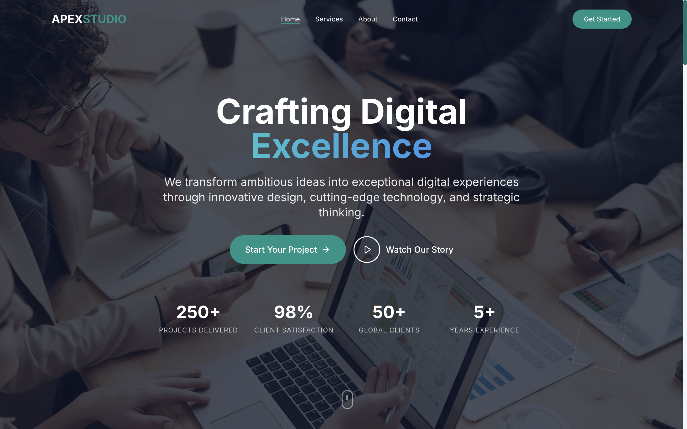

# Apex Studio - Premium Digital Agency Landing Page

## 🚀 Live Demo

**[View Live Demo →](https://premium-brand-landin-sg81.bolt.host)**

Experience the full interactive landing page with smooth animations, responsive design, and modern UI components.




---

## 📋 Overview

A modern, high-performance landing page for Apex Studio, a premium digital agency. Built with React, TypeScript, and Tailwind CSS, featuring sophisticated animations, responsive design, and optimal user experience across all devices.

## ✨ Features

### 🎨 Design & UI
- **Modern Professional Design** - Clean, contemporary aesthetics without gradients
- **Responsive Layout** - Seamless experience across mobile, tablet, and desktop
- **Cohesive Color Palette** - Professional blues, teals, and accent colors
- **Typography Excellence** - Inter font family with optimized readability
- **Accessibility First** - WCAG compliant with proper focus states and semantic HTML

### 🎭 Animations & Interactions
- **Smooth Scroll Animations** - Intersection Observer API for performance
- **Micro-interactions** - Hover effects and state transitions
- **Page Transitions** - Seamless section navigation
- **Loading Animations** - Staggered card reveals and fade-in effects
- **Interactive Elements** - Dynamic navigation and form feedback

### 🏗️ Technical Architecture
- **React 18** - Modern functional components with hooks
- **TypeScript** - Type-safe development with full IntelliSense
- **Tailwind CSS** - Utility-first styling with custom configurations
- **Vite** - Lightning-fast build tool and development server
- **Component Architecture** - Modular, reusable components
- **Performance Optimized** - Lazy loading, code splitting, and optimized assets

### 📱 Responsive Design
- **Mobile-First Approach** - Optimized for all screen sizes
- **Flexible Grid System** - CSS Grid and Flexbox layouts
- **Touch-Friendly** - Optimized interactions for mobile devices
- **Cross-Browser Compatible** - Tested across modern browsers

## 🛠️ Technology Stack

| Category | Technologies |
|----------|-------------|
| **Frontend** | React 18, TypeScript, Tailwind CSS |
| **Build Tool** | Vite |
| **Icons** | Lucide React |
| **Animations** | CSS3 Transitions, Intersection Observer API |
| **Deployment** | Bolt Hosting |
| **Code Quality** | ESLint, TypeScript strict mode |

## 📁 Project Structure

```
src/
├── components/           # Reusable UI components
│   ├── Header.tsx       # Navigation with scroll effects
│   ├── Hero.tsx         # Landing hero section
│   ├── Services.tsx     # Services showcase
│   ├── About.tsx        # Company information
│   ├── Contact.tsx      # Contact form
│   └── Footer.tsx       # Site footer
├── App.tsx              # Main application component
├── main.tsx             # Application entry point
├── index.css            # Global styles and utilities
└── vite-env.d.ts        # Vite type definitions
```

## 🚀 Getting Started

### Prerequisites
- Node.js 18+ 
- npm or yarn package manager

### Installation

1. **Clone the repository**
   ```bash
   git clone <repository-url>
   cd apex-studio-landing
   ```

2. **Install dependencies**
   ```bash
   npm install
   ```

3. **Start development server**
   ```bash
   npm run dev
   ```

4. **Open in browser**
   ```
   http://localhost:5173
   ```

### Build for Production

```bash
# Build optimized production bundle
npm run build

# Preview production build locally
npm run preview
```

## 🎯 Key Sections

### 🏠 Hero Section
- Compelling headline with animated text effects
- Call-to-action buttons with hover animations
- Background imagery with overlay effects
- Statistics showcase with animated counters

### 🛠️ Services Section
- Interactive service cards with hover effects
- Icon animations and micro-interactions
- Detailed feature lists with smooth reveals
- Responsive grid layout

### 👥 About Section
- Company story with scroll-triggered animations
- Team member profiles with image hover effects
- Core values presentation
- Mission and vision statements

### 📞 Contact Section
- Interactive contact form with validation
- Real-time form feedback and animations
- Contact information cards
- Success state animations

## 🎨 Design System

### Color Palette
```css
Primary: #1e293b (Slate 800)
Secondary: #0f766e (Teal 600)
Accent: #ea580c (Orange 600)
Background: #ffffff (White)
Text: #334155 (Slate 700)
```

### Typography
- **Font Family**: Inter (Google Fonts)
- **Headings**: 700-900 weight
- **Body**: 400-500 weight
- **Line Height**: 1.6 for body, 1.2 for headings

### Spacing System
- **Base Unit**: 8px
- **Scale**: 4px, 8px, 16px, 24px, 32px, 48px, 64px, 96px

## 📊 Performance Optimizations

- **Image Optimization** - WebP format with fallbacks
- **Lazy Loading** - Intersection Observer for images and components
- **Code Splitting** - Dynamic imports for route-based splitting
- **CSS Optimization** - Tailwind CSS purging and minification
- **Bundle Analysis** - Optimized chunk sizes and dependencies

## 🔧 Development Guidelines

### Code Style
- **TypeScript Strict Mode** - Full type safety
- **ESLint Configuration** - Consistent code formatting
- **Component Patterns** - Functional components with hooks
- **File Naming** - PascalCase for components, camelCase for utilities

### Best Practices
- **Accessibility** - ARIA labels, semantic HTML, keyboard navigation
- **Performance** - Optimized re-renders, memoization where needed
- **Maintainability** - Clear component separation, reusable utilities
- **Testing Ready** - Clean component architecture for easy testing

## 📱 Browser Support

| Browser | Version |
|---------|---------|
| Chrome | 90+ |
| Firefox | 88+ |
| Safari | 14+ |
| Edge | 90+ |

## 📄 License

This project is licensed under the MIT License - see the [LICENSE](LICENSE) file for details.

## 👨‍💻 Author

**Mutlu Kurt**
- Website: [Live Demo](https://premium-brand-landin-sg81.bolt.host)
- GitHub: [@mutlukurt](https://github.com/mutlukurt)

## 🤝 Contributing

Contributions, issues, and feature requests are welcome! Feel free to check the [issues page](../../issues).

## ⭐ Show Your Support

Give a ⭐️ if this project helped you!

---

<div align="center">
  <strong>Built with ❤️ using React, TypeScript, and Tailwind CSS</strong>
</div>